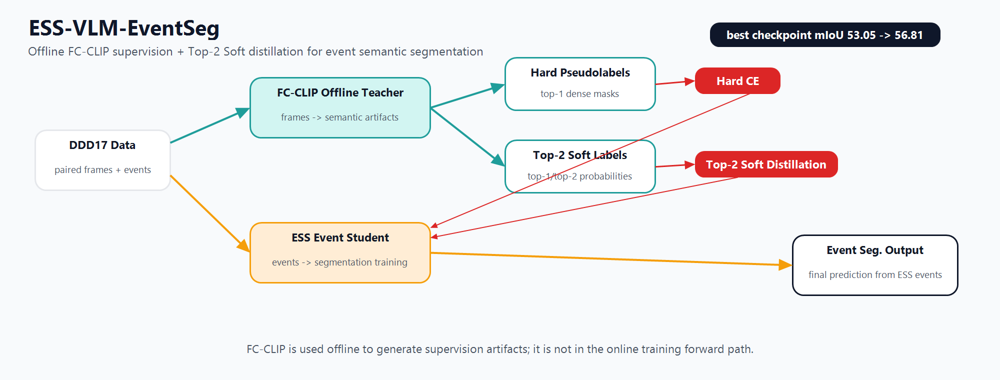
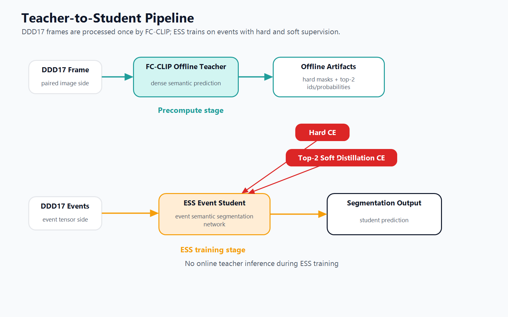
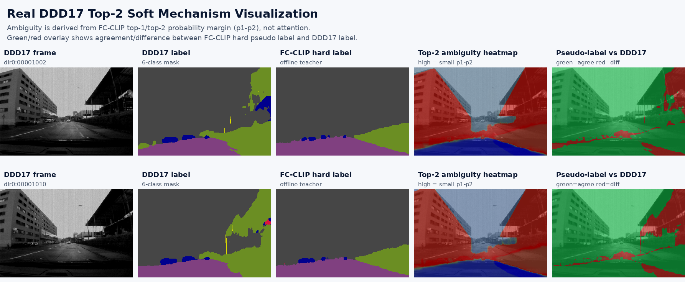
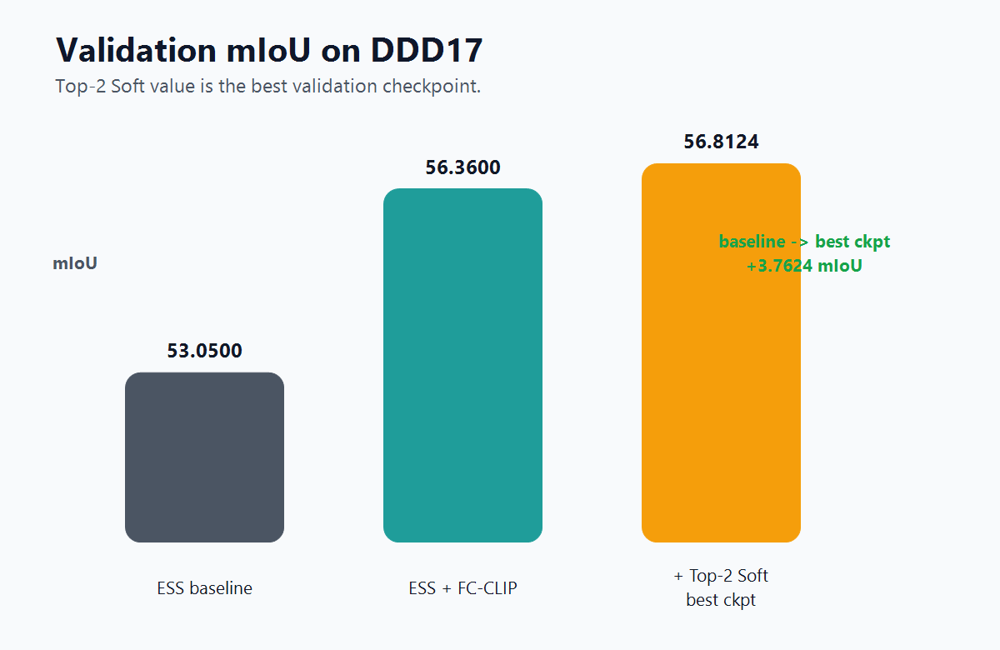
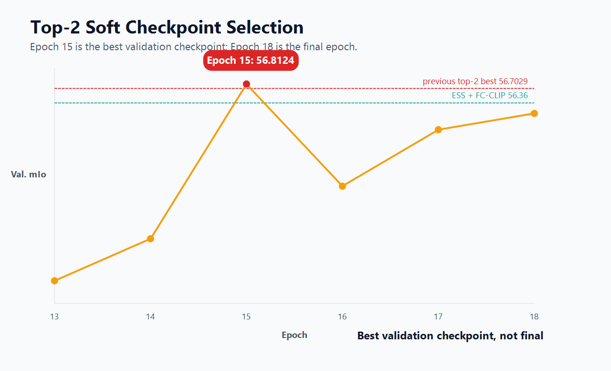

# ESS-VLM-EventSeg

Event-camera semantic segmentation with offline visual-language supervision on DDD17.

This repository is based on the official ESS codebase and adds a DDD17-focused VLM supervision branch. The main idea is to use FC-CLIP as an offline visual-language teacher to generate dense semantic pseudo labels from paired frames, then train the ESS event student with hard pseudo-label CE and Top-2 Soft distillation.

> Metric note: `56.8124` mIoU is the best validation checkpoint at Epoch 15. It is not the final epoch result. Do not describe this project as SOTA.

## Overview



## What Was Added

- `scripts/vlm/`: FC-CLIP dense pseudo-label export, confidence export, Top-2 soft-label export, and experiment launch scripts.
- `utils/fcclip_*`, `utils/top2_soft_distillation.py`, `utils/pixel_confidence_training.py`: pseudo-label processing and distillation utilities.
- `datasets/ddd17_events_loader.py`: DDD17 event loader support for hard pseudo labels, confidence maps, and Top-2 soft labels.
- `training/ess_trainer.py`: VLM pseudo-label loss and Top-2 Soft distillation loss integration.
- `config/settings_DDD17_fcclip_*.yaml`: experiment configurations for FC-CLIP, Top-2 Soft, confidence, VPR exploration, and smoke checks.
- `tests/`: unit/smoke tests for settings parsing, pseudo-label loading, confidence maps, and distillation loss.

## Method



The project uses a two-stage teacher-to-student design:

1. FC-CLIP runs offline on DDD17 paired frames and produces dense semantic artifacts.
2. The ESS student trains on event tensors only, using the offline artifacts as extra supervision.
3. Hard pseudo labels provide the primary VLM supervision.
4. Top-2 Soft distillation keeps the teacher's two most likely classes and their probabilities, so the event model can learn uncertainty instead of only a one-hot answer.

### Real Mechanism Visualization



The ambiguity heatmap is computed from FC-CLIP top-1/top-2 probability margins (`p1 - p2`), not from attention. Brighter regions indicate pixels where the offline teacher has closer top-1/top-2 alternatives, motivating Top-2 Soft targets instead of one-hot-only pseudo labels.

## Results on DDD17

| Method | Validation mIoU | Pixel Acc. | Note |
| --- | ---: | ---: | --- |
| ESS official baseline | 53.05 | 87.01 | Official DDD17 UDA checkpoint validation |
| ESS + FC-CLIP dense pseudo labels | 56.36 | 89.82 | Offline VLM pseudo-label supervision |
| ESS + FC-CLIP + Top-2 Soft | 56.8124 | 89.5776 | Epoch 15 best validation checkpoint |
| Top-2 Soft final epoch | 56.1059 | 89.6507 | Epoch 18 final epoch |





## Repository Layout

```text
config/                 Experiment YAML files
datasets/               DDD17 / Cityscapes / DSEC loaders inherited from ESS
docs/                   Method notes, experiment records, and Chinese explanation docs
scripts/bootstrap/      Dataset layout checks
scripts/vlm/            VLM pseudo-label export and experiment launch scripts
training/               ESS trainer with VLM losses
utils/                  Pseudo-label, confidence, and Top-2 Soft utilities
tests/                  Lightweight verification tests
assets/figures/         README figures
```

Raw datasets, generated pseudo labels, logs, checkpoints, and model weights are intentionally not committed.

## Data and Artifact Layout

Expected local layout after preparing data and external weights:

```text
ESS-VLM-EventSeg/
|-- data/
|   |-- ddd17_seg/data/
|   |-- cityscapes/
|   `-- ddd17_pseudolabels/
|       |-- fcclip_no_filter_cropped/
|       |-- fcclip_top2_soft_cropped/
|       `-- fcclip_confidence_cropped/
|-- weights/official/DDD17_UDA.pt.pt
`-- third_party/fc-clip/
    `-- checkpoints/
        |-- fcclip_convnext_large_eval_ade20k.pth
        `-- open_clip_model.safetensors
```

The official ESS DDD17 checkpoint is available from the ESS authors after filling their release form. FC-CLIP and OpenCLIP weights should be downloaded according to the FC-CLIP project instructions or your own experiment record.

## Environment

The original experiments used Python 3.10, PyTorch with CUDA, and a separate FC-CLIP environment for pseudo-label export. A practical setup is:

```bash
conda create -n essvlm python=3.10 -y
conda activate essvlm
pip install -r requirements.txt
```

FC-CLIP export depends on Detectron2/FC-CLIP. Clone FC-CLIP into `third_party/fc-clip` and install its dependencies separately:

```bash
mkdir -p third_party
git clone https://github.com/bytedance/fc-clip.git third_party/fc-clip
```

## Run

First verify the DDD17 layout:

```bash
python scripts/bootstrap/verify_ddd17_layout.py --dataset-root data/ddd17_seg/data
```

Generate hard FC-CLIP pseudo labels:

```bash
bash scripts/vlm/run_ddd17_fcclip_main.sh
```

Generate Top-2 Soft labels:

```bash
bash scripts/vlm/run_ddd17_fcclip_top2_soft.sh smoke
```

Run the selected Top-2 Soft training branch:

```bash
ESS_RUN_TRAIN=1 bash scripts/vlm/run_ddd17_top2_soft_best_ckpt_optimization.sh full
```

For smoke-only checks, omit `ESS_RUN_TRAIN=1`. The scripts then verify config/artifact paths without launching full training.

## Citation

This project builds on ESS. If you use the original ESS code or checkpoints, cite:

```bibtex
@Article{Sun22eccv,
  author  = {Zhaoning Sun and Nico Messikommer and Daniel Gehrig and Davide Scaramuzza},
  title   = {ESS: Learning Event-based Semantic Segmentation from Still Images},
  journal = {European Conference on Computer Vision. (ECCV)},
  year    = {2022},
}
```

Also cite FC-CLIP, DDD17, Cityscapes, and related datasets/models according to their licenses and papers.

## Disclaimer

This repository is a research reproduction and extension package. The reported best number is checkpoint-based validation performance on DDD17, not a new SOTA claim.
